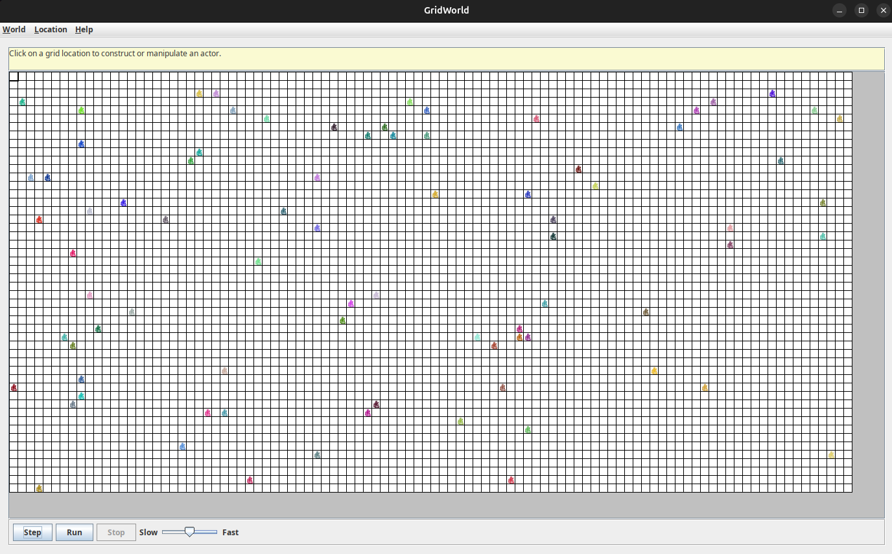
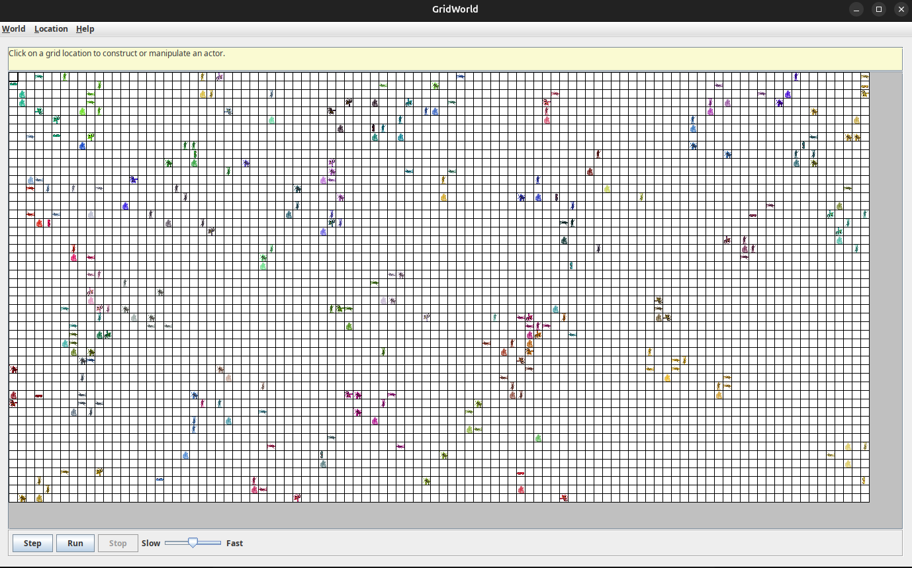
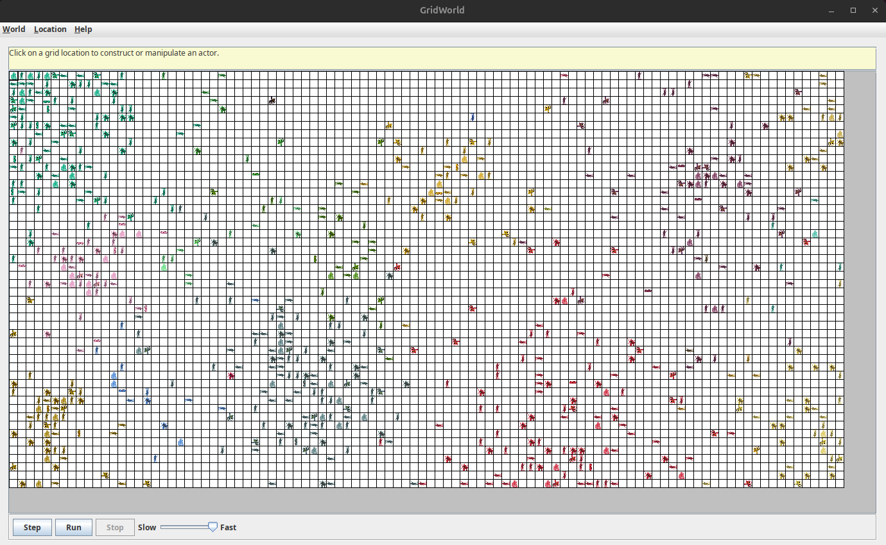
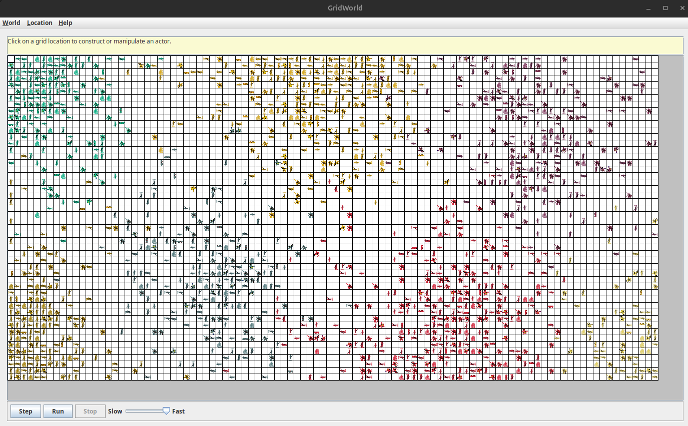
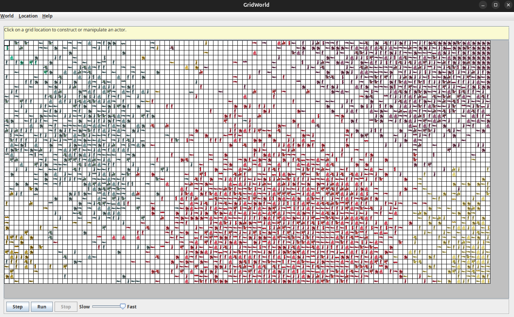

# Medieval Warzone Project

**Author:** Richard Higgins

This project was from my highschool computer science class in the year 2008.

## Original Mission Statement

This project implements Gridworld to create a medieval era environment. The landscape includes classes such as *Fighter*, *Archer*, *FootSoldier*, *Horseman*, and *Fortress*. Each class is represented by a unique image and possesses distinct movement and combat behaviors. In this architecture, **FootSoldier** and **Horseman** extend `Bug`, whereas **Archer** and **Fortress** extend `Critter`.

---

## Running

1. First `git clone https://github.com/parkr/GridWorld` (thanks parkr)
2. Then `java -cp .:GridWorld/gridworld.jar GridGenerator.java`

## Examples

Here is a starting grid, you can see some castles have been randomly placed in the gridworld:

Here is after a few steps of operations, where castles have spawned some units.

Here is as the empires spawn peasants and those peasants build more castles of their own type.

Here is in the middle of combat, you can see some empires have been destroyed.

Here is after many rounds, where only a few empires remain.

## Classes

### Fighter
- Overarching class with a basic implementation, originally defined as an object originating from a Fortress.
- **NOTE:** Now Defunct.

### FootSoldier
- Basic soldier.
- **Extends:** `Bug`
- **Spawning:** Most common spawn of a Fortress.
- **Movement:** One movement per turn.
- **Attack:** Fires in a straight line.
- **Behavior:** Mimics a Spiral Bug by attacking outwards from the fortress in a spiral  
  (or, similarly, a Rockhound).
- **Customization:** Modified implementations for `act()`, `canMove()`, and `move()` compared to a standard `Bug`.

### Archer
- More complicated soldier.
- **Extends:** `Critter`
- **Spawning:** Third most common spawn of a Fortress.
- **Movement:** One movement per turn.
- **Strategy:** Analyzes nearby locations before executing a random movement and attack.
- **Attack Chance:** 1/8 chance of attacking (resulting in approximately one attack per turn given 8 potential targets).
- **Attack Method:** Attacks neighboring locations.
- **Customization:** Modified implementations for `processActors()` and `act()` compared to a standard `Critter`.

### Horseman
- An enhanced version of the FootSoldier.
- **Extends:** `Bug`
- **Spawning:** Second most common spawn of a Fortress.
- **Movement:** Two spaces per turn.
- **Attack:** Fires in a straight line.
- **Behavior:** Mimics a Spiral Bug by attacking outwards from the fortress in a spiral  
  (or, similarly, a Rockhound).
- **Customization:** Modified implementations for `act()`, `canMove()`, and `move()` compared to a standard `Bug`.

### Fortress
- Acts as a spawning point and serves as the general locus of a color empire.
- **Extends:** `Critter`
  - Primarily extends `Critter` to utilize its spawning capabilities.
  - Movement is similar to a rock (i.e., essentially stationary).
- **Spawning Behavior:** Randomly places soldiers around itself using the `getMoveLocations()` array.
- **Note:** Does not move or attack.
- **Customization:** Modified `act()` method to serve its role as a spawn point.

### Peasent (NEW)
- Basic builder unit.
- **Extends:** `Bug`
- **Spawning:** Fourth most common spawn from a Fortress.
- **Movement:** One movement per turn.
- **Attack:** Does not attack.
- **Special Ability:** Has a chance (currently 1/30) of creating a new Fortress at its current location.
- **Behavior:** Mimics a Spiral Bug by moving outwards from the fortress in a spiral  
  (or, similarly, a Rockhound).
- **Customization:** Modified implementations for `act()` and `move()` compared to a standard `Bug`.

---

## Original Outline (Pre-Production)

- **Horseman:**  
  Moves similarly to a Spiral Bug but covers two locations per act.
- **FootSoldier:**  
  Moves similarly to a Spiral Bug but only covers one location per act.
- **Archer:**  
  Behaves like a `Critter` but only has a 1 in 8 chance of killing a neighboring creature.
- **Fortress:**  
  Functions as a spawn point. By leveraging its `Critter` methods, it randomly produces either an Archer, FootSoldier, or Horseman in an adjacent location.  
  All objects maintain the same color as the Fortress; as a result, entities sharing the same color do not attack one another.

---

## Prior Materials to Aid the Project

- **GridGenerator Class:**
  - Generates a grid based on user-defined proportions.
  - Can randomly populate the grid with objects (for example, a 1 in 10 chance of placing a `Bug` in each square).
- **Gridworld Provided Classes**

---

## Project Log

**Friday, May 9, 2008**
- Acquired images for the following classes: `Fighter`, `FootSoldier`, `Horseman`, `Archer`, and `Fortress`.
- Began coding on the above classes.
- Completed a large section of coding; faced challenges with determining friend vs. foe based on color.

**Tuesday, May 13, 2008**
- The `Fighter` class became defunct and was merged with `FootSoldier`.
- Added the `Peasent` class, which has a 1/30 chance of spawning a new Fortress and does not attack.
- Acquired an image for the `Peasent` class.
- Tweaked the spawning ratios for the `Fortress` class.
- Resolved an `ArrayIndexOutOfBounds` exception that occurred when a `Fortress` had no empty adjacent locations for spawning.

